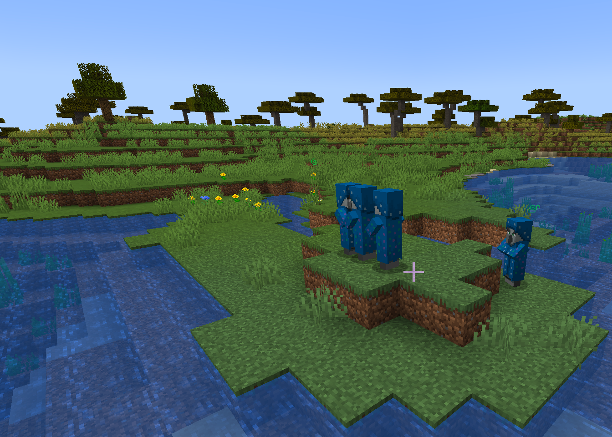

## Compatibility

Tested on Spigot-1.19.

## Introduction

A Minecraft (Bukkit) plugin that spawns an illusioner when the player doesn't expect it.

## Features

* Synergies perfectly with TakeAim and CustomCreatures plugins, please see links below
* No more than one illusioner per user on the server at the same time
* Illusioners don't despawn and teleport to the players projected route when they run too far away

#### Spawn triggers
* A player has been running in one direction 80% of the last 60 seconds

## Commands

`nastyillusioner reload` - reload config from disk

`nastyillusioner info [@player]` - show player status

`nastyillusioner reset [@player]` - reset player status

## Permissions

* Access to 'reload' command:
`nastyillusioner.reload` (default: op)

* Access to 'info' command:
`nastyillusioner.info` (default: op)

* Access to 'reset' command:
`nastyillusioner.reset` (default: op)

## Configuration
[Default configuration file](src/main/resources/config.yml)

## Author
I will be happy to add some features or fix bugs. My mail: uprial@gmail.com.

## Useful links
* [Project on GitHub](https://github.com/uprial/nastyillusioner)
* [Project on Bukkit Dev](https://legacy.curseforge.com/minecraft/bukkit-plugins/nastyillusioner)
* [Project on Spigot](https://www.spigotmc.org/resources/nastyillusioner.109715/)

## Related projects
* CustomNukes: [Bukkit Dev](http://dev.bukkit.org/bukkit-plugins/customnukes/), [GitHub](https://github.com/uprial/customnukes), [Spigot](https://www.spigotmc.org/resources/customnukes.68710/)
* CustomCreatures: [Bukkit Dev](http://dev.bukkit.org/bukkit-plugins/customcreatures/), [GitHub](https://github.com/uprial/customcreatures), [Spigot](https://www.spigotmc.org/resources/customcreatures.68711/)
* CustomDamage: [Bukkit Dev](http://dev.bukkit.org/bukkit-plugins/customdamage/), [GitHub](https://github.com/uprial/customdamage), [Spigot](https://www.spigotmc.org/resources/customdamage.68712/)
* CustomRecipes: [Bukkit Dev](https://dev.bukkit.org/projects/custom-recipes), [GitHub](https://github.com/uprial/customrecipes/), [Spigot](https://www.spigotmc.org/resources/customrecipes.89435/)
* TakeAim: [Bukkit Dev](https://dev.bukkit.org/projects/takeaim), [GitHub](https://github.com/uprial/takeaim), [Spigot](https://www.spigotmc.org/resources/takeaim.68713/)
* CustomVillage: [Bukkit Dev](http://dev.bukkit.org/bukkit-plugins/customvillage/), [GitHub](https://github.com/uprial/customvillage/), [Spigot](https://www.spigotmc.org/resources/customvillage.69170/)
* RespawnLimiter: [Bukkit Dev](https://www.curseforge.com/minecraft/bukkit-plugins/respawn-limiter), [GitHub](https://github.com/uprial/respawnlimiter/), [Spigot](https://www.spigotmc.org/resources/respawnlimiter.106469/)
